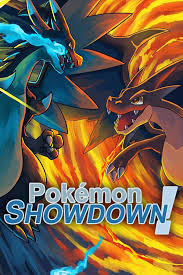
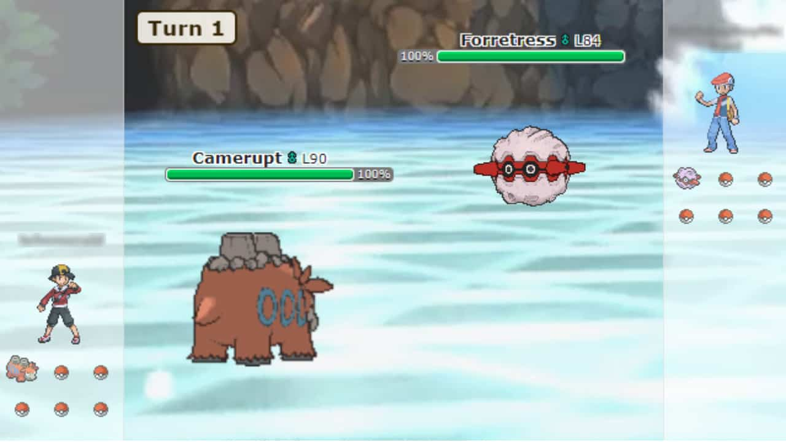
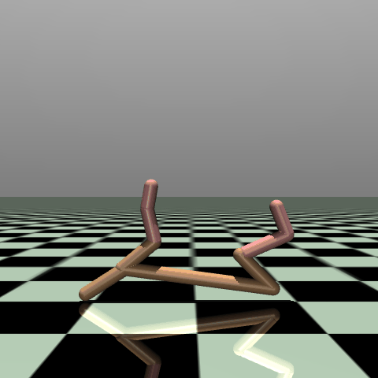

# Pokemon Showdown Reinforcement Learning Environment
Base code and templates for creating the Pokemon Showdown Reinforcement Learning environment. This document provides all the instructions to setup and create the environment.

## Pokemon Showdown
This online battle simulator allows users to engage in Pokémon battles, including randomly generated teams or custom teams.

Additional details https://pokemonshowdown.com/

<p align="center">
    
</p>

## Objective
There are two objectives to this assignment. The first is to implement your version of the "showdown_environment.py" environment to enable a Reinforcement Learning agent to learn to competitively battle Pokemon in the Pokemon Showdown game. You are free to choose how you implement the environment, using any methodology or resources online that you wish. The second is to chose which algorithm is appropriate for then learning to complete the task. 

The core objective is to consider what information is required from the agent, and to get hands on experience using machine learning to solve a complex task. Your exploraiton into solving this problem will provide key insights into the material - which you will demonstrate in the report by explaining how you approached solving this complex task with reinforcement learning and what you experienced along the way. This is not a trivial task to learn - demonstrating that you can ***connect the dots in the lectures to the challenges you face throughout the assignment*** is what we are looking for.

The full details of the assignment marking and expectations of the report are laid out on Canvas: 

<p align="center">
    
</p>

# Setup
Follow these steps carefully to pull the required libraries and packages to do this assignment. These instructions will default to using a folder called "~/compsys726" to manage the required packages but you may pull these packages into any directory you desire.

The assignment has been developed for python3.10 and it is recommended you use a python virtual environment for working on this assignment. I recommend pyenv but you can use whichever you are fimilar with. 

These instructions are written based on using Ubuntu 22.04 but will suffice for Windows/MAC users as well - but may require changes to certain commands. Any specific issues with following these instructions please message the teaching staff on Slack.


## Base Folder
Create the base folder for working with this assignment. If you wish to change which directory you set this assignment up in, please make sure to read the following instructions carefully to avoid putting things in the wrong place. 

```
mkdir ~/compsys726
```

## Create Virtual Environment (PERSONAL MACHINE ONLY)
It is strongly recommended that you use a virtual environment on your personal machine to better control the requirements used in this project.
The instructions below will show you how to create a pyenv environment - you are free to use your preference of virtual environment though.
If you are working on the University of Auckland lab machines ***skip this step*** as these configurations have already been tested. 

```
python3 -m venv ~/venv/pokemon
```

Remember to activate the virtual environment every time you open a new tab to load the right environment. 

```
source ~/venv/pokemon/bin/activate
```

**Pro tip** on Ubuntu you can put this inside of the **~/.bashrc** with an alias command to make this easier. The example below will activate the environment through the **pkm** command. 

```
echo "alias pkm='source ~/venv/pokemon/bin/activate'" >> ~/.bashrc
source ~/.bashrc
```

## Install Pokemon Showdown
Clone and install the Pokemon Showdown server for running and testing locally. Note if you have done this for the epxert agent assignment, you don't need to replicate this step.

```
cd ~/compsys726
git clone https://github.com/smogon/pokemon-showdown.git
cd pokemon-showdown
npm install
cp config/config-example.js config/config.js
```
## Run Pokemon Showdown
Make sure the Pokemon Showdown server is always running when you are testing.
If things break or don't connect then restarting the server can sometimes fix things.

```
node pokemon-showdown start --no-security
```

## Install Required Packages
This assignment requires three key packages to operate - you'll need to install them in a specific order as laid out below.

### 1: cares_reinforcement_learning
The cares_reinforcement_learning package provides implementations of modern Reinforcement Learning algorithms and utlities for doing research. This package contains the reinforcement learning algorithms and implementations you can leverage to learn to play Pokemon. Further details can be explored here: https://github.com/UoA-CARES/cares_reinforcement_learning

```
cd ~/compsys726
git clone https://github.com/UoA-CARES/cares_reinforcement_learning.git
cd cares_reinforcement_learning
pip3 install -r requirements.txt
pip3 install --editable .
```

### 2: showdown_gym (primary package)
This is the current package - it contains the requirements for implementing the Pokemon Environment for this project. All your work will be done in this specific package. This is explained in further details below. 

```
cd ~/compsys726
git clone https://github.com/UoA-CARES/showdown_gym.git
cd showdown_gym
pip3 install -r requirements.txt
pip3 install --editable .
```

### 3: gymnasium_envrionments
We have created a standardised general purpose gym that wraps the most common simulated environments used in reinforcement learning into a single easy to use place. This package serves as an example of how to develop and setup new environments - particularly for the robotic environments. This package utilises the algorithms implemented in the repository https://github.com/UoA-CARES/cares_reinforcement_learning/ and the Pokemon Environment you will implement here in showdown_gym. Additional information can found here: https://github.com/UoA-CARES/gymnasium_envrionments

This package is how you will run the training agent and test your Showdown Environment. It enables all the standardised logging and configuration handling for your evaluations.

```
cd ~/compsys726
git clone https://github.com/UoA-CARES/gymnasium_envrionments.git 
cd gymnasium_envrionments
pip3 install -r requirements.txt
```

To test that everything has installed correctly you can test training an RL agent for the OpenAI **HalfCheetah** task. The `run.py` takes in hyperparameters that allow you to customise the training enviromment – OpenAI, DMCS Environment, Showdown - or RL algorithm. Use `python3 run.py -h` for help on what parameters are available for customisation.

To test that everything has installed correctly you can run an example of the openai environment with TD3 through the console command below.

```
cd ~/compsys726/gymnasium_envrionments/scripts
python run.py train cli --gym openai --task HalfCheetah-v5 TD3 --display 1
```

You should see the environment on screen with the robot in the image below trying to learn to run:

<p align="center">
    
</p>

# Showdown Training
To run the Showdown Environment you need to run it through the ***gymnasium_envrionments*** package. The Showdown environment is not currently implemented - it is your job to complete the state, action, and reward functions for the agent to learn from. The current implementation shows a basic functional example but this is insufficient to learn from. 

To train an agent on the environment you can use the command below. The ***domain*** defines the type of Pokemon team you will be training with and against. The ***task*** defines the type of expert agent that the agent will train to beat. 

```
cd ~/compsys726/gymnasium_envrionments/scripts
python run.py train cli --gym showdown --domain random --task max DQN
```

In the case of this assignment your goal is to beat the ***max*** agent (task) in the ***random*** domain. The random domain creates a random team for each player each game, meaning the agent will need to adapt to ***any*** Pokemon team it may use or compete against.

## Viewing Training Results
The results of training the agents is saved into this folder: ***~/cares_rl_logs/*** by default. The structure of the results is saved as below.

```text
├─ <log_path>
|  ├─ env_config.json
|  ├─ alg_config.json
|  ├─ train_config.json
|  ├─ *_config.json
|  ├─ ...
|  ├─ SEED_N
|  |  ├─ data
|  |  |  ├─ train.csv
|  |  |  ├─ eval.csv
|  |  ├─ figures
|  |  |  ├─ eval.png
|  |  |  ├─ train.png
|  |  ├─ models
|  |  |  ├─ model.pht
|  |  |  ├─ CHECKPOINT_N.pht
|  |  |  ├─ ...
|  |  ├─ videos
|  |  |  ├─ STEP.mp4
|  |  |  ├─ ...
|  ├─ SEED_N
|  |  ├─ ...
|  ├─ ...
```

The data folder contains all the training/evaluation data from the training process. The figures will default to plotting the reward throughout the training and evaluation phases. If you want to produce plots of other information you can use the plotter with commands similar too below:

```
cd ~/compsys726/cares_reinforcement_learning/cares_reinforcement_learning/util
python plotter.py -s ~/cares_rl_logs -d ~/cares_rl_logs/ALGORITHM/ALGORITHM-TASK-YY_MM_DD:HH:MM:SS --y_train win --y_eval win
```

The command above will plot the average win rate of the agent at each step during training and evaluation. The win rate is what will be used to evaluate your agent. 

For full commands for plotting results data see the help data for plotter.

```
python plotter.py -h
```

# Algorithm Selection
As part of your project, you are required to select a reinforcement learning (RL) algorithm to train your agent to play Pokémon Showdown. You are responsible for justifying your choice. There is no single correct answer, choose the method you believe is most appropriate based on your understanding of the problem and the strengths of different RL algorithms. A wide range of algorithms are already implemented in the ***cares_reinforcement_learning*** library you are free to choose any of these algorithms (note the image based methods aren't useable due to no image representation being available). We are not expecting anyone to implement additional algorithms.

All methods are implemented with their base configurations (network and hyperparameter settings) from their original paper implementations - you are free to consider changing these parameters if you feel it is required. The default values for all algorithms can be found [here](https://github.com/UoA-CARES/cares_reinforcement_learning/blob/main/cares_reinforcement_learning/util/configurations.py). **Do NOT edit** the configurations code directly to change hyperparameters. The run command can be used to adjust the various hyperparameters you can tune for each algorithm. The example below changes the **tau** value for DQN. 

```
cd ~/compsys726/gymnasium_envrionments/scripts
python run.py train cli --gym showdown --domain random --task max DQN --tau 0.5
```

The logs will then record the configuration files you can then resuse using the command below. If you wish to edit the network structure itself you will need to edit the ***alg_config.json*** file - this can't be changed via command line. 

***env_config*** - should be left untouched as it defines the task you are training on. This should ***NOT*** change.

***traing_config*** - provides information about the training configuration for this run. It is not recommended that you modify these parameters.

***alg_config.json*** - provides configurations for the algorithm, you can modify the hyperparameters and network architectures if you feel it is required here.

```
python run.py train config --data_path PATH_TO_RUN_CONFIGURATIONS_FOLDER
```

# Implementing your Showdown Environment
Your Pokemon Environment will be fully implemented in ***showdown_environment.py***. The goal is to determine a suitable state representation, set of actions, and reward function to enable the agent to learn to beat the ***max*** expert agentin the **random** domain. Do not edit any other files and do not create any other files. 

## showdown_environment.py
The ShowdownEnvironment class represents the Showdown game environment for the agent. You are free to modify and expand the class and add additional features/functions required to implement your environment but only inside that file. This is not best coding practice but it makes the lecturers lives easier.

There are two primary functions in the class that you need to implement in order to provde the agent with useful information to learn from. 

### State - embed_battle
The ***embed_battle*** function returns to the state information to the agent - the current observation of Showdown. The provided example returns the current helth of the agents pokemon and the opponents pokemon. You will need to expand on this state representation to incorporate what you determine to be the best observation for the agent.

```python
def embed_battle(self, battle: AbstractBattle) -> np.ndarray:
    """
    Embeds the current state of a Pokémon battle into a numerical vector representation.
    This method generates a feature vector that represents the current state of the battle,
    this is used by the agent to make decisions.

    You need to implement this method to define how the battle state is represented.

    Args:
        battle (AbstractBattle): The current battle instance containing information about
            the player's team and the opponent's team.
    Returns:
        np.float32: A 1D numpy array containing the state you want the agent to observe.
    """

    health_team = [mon.current_hp_fraction for mon in battle.team.values()]
    health_opponent = [
        mon.current_hp_fraction for mon in battle.opponent_team.values()
    ]

    # Ensure health_opponent has 6 components, filling missing values with 1.0 (fraction of health)
    if len(health_opponent) < len(health_team):
        health_opponent.extend([1.0] * (len(health_team) - len(health_opponent)))

    # Final vector - single array with health of both teams
    final_vector = np.concatenate(
        [
            health_team,  # N components for the health of each pokemon
            health_opponent,  # N components for the health of opponent pokemon
        ]
    )

    return final_vector
```

The function below returns the size of the embedding for the environment - this is critical for the correct setup of the network sizes. I couldn't find a way to automate this step as the battle object isn't created until after the setup of the environment. You will need to ***manually*** change this number to align with the size of the encoding vector returned by ***embed_battle***. Yes, I know this is annoying and dumb - but for the life of me I couldn't find a work around that wasn't significantly more jank.

```python
def _observation_size(self) -> int:
        """
        Returns the size of the observation size to create the observation space for all possible agents in the environment.

        You need to set obvervation size to the number of features you want to include in the observation.
        Annoyingly, you need to set this manually based on the features you want to include in the observation from emded_battle.

        Returns:
            int: The size of the observation space.
        """

        # Simply change this number to the number of features you want to include in the observation from embed_battle.
        # If you find a way to automate this, please let me know!
        return 12
```

### Reward - calc_reward
The ***calc_reward*** function determines the reward for the current action. The current example returns a reward based on the difference between the oppononets current health and prior health, effectively giving reward for doing damage. You will need to develop your own reward function to guide the agent's learning.

```python
def calc_reward(self, battle: AbstractBattle) -> float:
    """
    Calculates the reward based on the changes in state of the battle.

    You need to implement this method to define how the reward is calculated

    Args:
        battle (AbstractBattle): The current battle instance containing information
            about the player's team and the opponent's team.
        prior_battle (AbstractBattle): The prior battle instance to compare against.
    Returns:
        float: The calculated reward based on the change in state of the battle.
    """

    prior_battle = self._get_prior_battle(battle)

    reward = 0.0

    health_team = [mon.current_hp_fraction for mon in battle.team.values()]
    health_opponent = [
        mon.current_hp_fraction for mon in battle.opponent_team.values()
    ]

    # If the opponent has less than 6 Pokémon, fill the missing values with 1.0 (fraction of health)
    if len(health_opponent) < len(health_team):
        health_opponent.extend([1.0] * (len(health_team) - len(health_opponent)))

    prior_health_opponent = []
    if prior_battle is not None:
        prior_health_opponent = [
            mon.current_hp_fraction for mon in prior_battle.opponent_team.values()
        ]

    # Ensure health_opponent has 6 components, filling missing values with 1.0 (fraction of health)
    if len(prior_health_opponent) < len(health_team):
        prior_health_opponent.extend(
            [1.0] * (len(health_team) - len(prior_health_opponent))
        )

    diff_health_opponent = np.array(prior_health_opponent) - np.array(
        health_opponent
    )

    # Reward for reducing the opponent's health
    reward += np.sum(diff_health_opponent)

    return reward
```

### Training/Evaluation Info - get_additional_info
You will want to produce quantified performance metrics for your agent throughout the training beyond just the reward given to the agent. To add additional information to be plotted later you can extend the ***get_additional_info*** function. This will return to the training system additonal information about the progress of the agent in the battle that you can use to evaluate your agent. Note that the info data will only show the information from the last step of the episode. 

```python
def get_additional_info(self) -> Dict[str, Dict[str, Any]]:
    info = super().get_additional_info()

    # Add any additional information you want to include in the info dictionary that is saved in logs
    # For example, you can add the win status

    if self.battle1 is not None:
        agent = self.possible_agents[0]
        info[agent]["win"] = self.battle1.won

    return info
```

# Submission
You will submit your ***showdown_environment.py*** file, training logs for your best agent, and **requirements.txt** through the instructions below to the given Google Drive. No other files will be utilised - the code needs to be self sufficient within ***showdown_environment.py*** and the full log file for the agent provided. All additional package requirements beyond the provided requirements must be captured in the **requirements.txt**. Failure to do this correctly may lead to a score of zero - test scripts are provided to make sure you have correctly set things up.

## Step 1 - Create requirements.txt
You need to create a requirements.txt that contains all the python packages you are using for your expert agent. This can easily be generated by running 'pipreqs' in the **root directory** of the package.

```
pip3 install pipreqs
cd ~/compsys726/showdown_gym
python3 -m pipreqs.pipreqs --force
```

This will regenerate the **requirements.txt** file with your specific packages and their versions. This will enable your agent to operate as expected. 

## Step 2 - Validate Files
To validate that the requirements and everything is correct - we will create an empty virtual environment to test the installation of your agent. 

Create a new fresh virtual envrionment.

```
python3 -m venv ~/venv/test
source ~/venv/test/bin/activate
```

Follow the installation instructions above again for this assignment in the new virtual environment. If all works as expected then you are good to go, if there are missing modules or issues then update your requirements and try again. NOTE: delete the venv to make it fresh each time!

```
rm -r ~/venv/test
```

## Step 3 - Upload Files to Google Drive
Following this link: https://drive.google.com/drive/folders/1nuXDLVTvc9crlSS7gU0rDGpQSBKTiNo5

Create a folder using your ***upi*** as the name. Copy your **requirements.txt**, **showdown_environment.py**, and results folder from **~/cares_rl_logs/** into the folder. These files can be updated as many times as you wish until the final deadline. 

# Evaluation
The assignment will be evaluated based on how effectively your environment enables an agent to learn against the ***max*** expert agent (***task***) in the ***random*** domain. The random domain creates a random team for each player each game, meaning the agent will need to adapt to ***any*** Pokemon team it may use or compete against. There will be bonus points for demonstrating the ***optional*** ability to train an agent to be effective against the challenging ***simple*** expert agent (***task***).

## Marking Guide
Your trained agent will be evaluated based on its win rate performance against the ***max expert agent*** over 100 battles through testing comamnds in gym_environment. You can run this locally using the instructions below to get an indication of your mark and metrics for your report. The **final mark** used for your grade will be scored from running the code locally by the teaching staff. 

```
python run.py test --data_path PATH_TO_RL_LOGS --seeds 10 --episodes 100
```

An example of this here for a prior training with DQN.
```
python run.py test --data_path ~/cares_rl_logs/DQN/DQN-random-max-25_07_04_09-00-39/ --seeds 10 --episodes 100
```

The breakdown of marks is shown below based the performance of your agent.

| Max Damage Expert Agent (Win Rate) | **Marks**       |
|-------------------------|-----------------|
| max (≥ 95%)             | 10.0%           |
| max (≥ 90%)             | 9.0%            |
| max (≥ 80%)             | 8.0%            |
| max (≥ 70%)             | 7.0%            |
| max (≥ 60%)             | 6.0%            |
| max (≥ 50%)             | 5.0%            |
| max (≥ 40%)             | 4.0%            |
| max (≥ 30%)             | 3.0%            |
| max (≥ 20%)             | 2.0%            |
| max (≥ 10%)             | 1.0%            |
| max (< 10%)             | 0.0%            |

The primary goal is to train an agent capable of beating the ***max*** expert agent. For those wishing to push themselves there are **bonus marks** for anyone who trains their agent to perform against the ***simple*** expert agent. 

| Simple Expert Agent (Win Rate)    | **Bonus Marks** |
|-------------------------|-----------------|
| simple (≥ 90%)          | +5%             |
| simple (≥ 80%)          | +4%             |
| simple (≥ 70%)          | +3%             |
| simple (≥ 60%)          | +2%             |
| simple (≥ 50%)          | +1%             |


